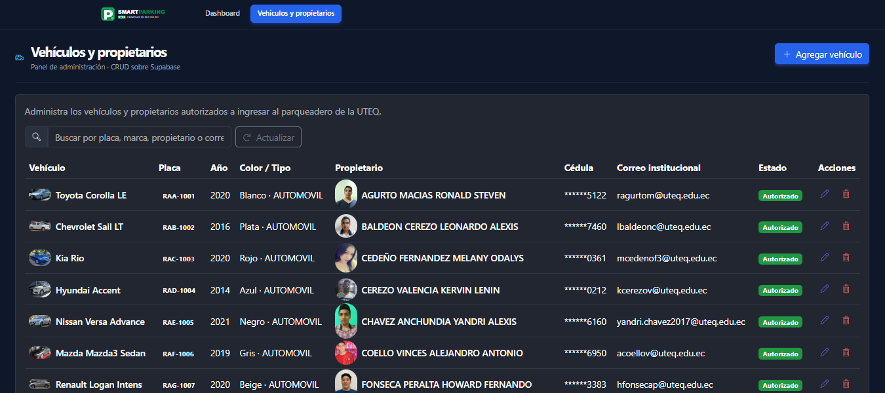

# Smart Parking UTEQ

Aplicación web del parqueadero inteligente de la UTEQ. El repositorio contiene
dos módulos independientes construidos sobre la misma base de React + Vite:

1. **Simulador IoT** (`/estacionamiento`): monitoreo en tiempo real de 80
   espacios de estacionamiento sobre **Firebase Realtime Database**.
2. **Panel de administración** (`/parqueadero/vehiculos`): CRUD completo de
   vehículos y propietarios sobre **Supabase**, construido con **CoreUI**.
   Es el módulo desarrollado en la práctica *"Panel de Administración del
   Smart Parking UTEQ"*.
3. **Monitoreo de entrada** (`/parqueadero/monitoreo-entrada`): captura una
   foto con la cámara del dispositivo (o selecciona una imagen JPG/PNG),
   la envía a un endpoint REST de reconocimiento de placas (OCR) y
   muestra si el vehículo está registrado y autorizado en Supabase. Es el
   módulo desarrollado en la práctica *"Monitoreo inteligente de ingreso
   vehicular"*.



> Reemplaza la imagen de arriba (`docs/screenshot-panel-vehiculos.png`) por
> una captura real del panel una vez que lo ejecutes localmente.

## Tecnologías utilizadas

| Módulo                | Tecnologías |
|------------------------|-------------|
| Simulador IoT           | React, Vite, Firebase Realtime Database, Leaflet / React-Leaflet, Lucide React |
| Panel de administración | React, Vite, React Router, **CoreUI (@coreui/react)**, **Supabase (@supabase/supabase-js)** |
| Monitoreo de entrada     | React, **MediaDevices API** (`getUserMedia`), `fetch` contra un endpoint REST de OCR (Azure Function) |

## Estructura del proyecto (nuevas carpetas/archivos de esta práctica)

```
src/
├─ assets/
│  └─ Logo.jsx                     # Logo institucional (SVG)
├─ layout/
│  ├─ AdminLayout.jsx              # Sidebar + header CoreUI del panel admin
│  ├─ admin-layout.css             # Estilos responsivos del layout admin
│  └─ nav.jsx                      # Ítem de menú "Vehículos y propietarios"
├─ lib/
│  └─ supabase.js                  # Cliente de Supabase (createClient)
├─ hooks/
│  ├─ useVehiculos.js              # Listado, búsqueda, paginación y CRUD
│  ├─ useCamara.js                 # Acceso a la cámara (getUserMedia) y captura a Blob
│  └─ useDeteccionPlaca.js         # Consumo del endpoint REST de OCR
├─ views/
│  └─ parqueadero/
│     ├─ ListaVehiculos.jsx        # Vista principal (tabla, búsqueda, paginación)
│     ├─ VehiculoFormModal.jsx     # Modal de alta/edición con validaciones
│     ├─ ConfirmDeleteModal.jsx    # Modal de confirmación de borrado
│     ├─ vehiculo.utils.js         # Validaciones y normalización de datos
│     ├─ MonitoreoEntrada.jsx      # Vista de monitoreo de entrada (cámara + OCR)
│     ├─ monitoreo.utils.js        # Validación de imágenes y mapeo de estados del OCR
│     └─ monitoreo.css             # Estilos de la vista de monitoreo
supabase_parqueadero_uteq.sql      # Script SQL (tablas, datos, RLS)
.env.example                       # Plantilla de variables de entorno
```

## Requisitos previos

- Node.js 18+
- Una cuenta y proyecto en [Supabase](https://supabase.com)

## Configuración de Supabase

1. Crea un proyecto en Supabase (o usa uno existente).
2. Abre el **SQL Editor** del proyecto y ejecuta el contenido completo de
   [`supabase_parqueadero_uteq.sql`](./supabase_parqueadero_uteq.sql). El
   script:
   - Crea las tablas `vehiculos`, `puestos` y `registros_estacionamiento`.
   - Carga los 38 vehículos/propietarios de ejemplo.
   - Habilita **Row Level Security (RLS)** en las tres tablas.
   - Otorga al panel de administración permisos de `select`, `insert`,
     `update` y `delete` sobre `vehiculos`, con políticas que validan el
     formato de placa, cédula y año también a nivel de base de datos.
3. Verifica en **Table Editor -> vehiculos -> RLS** que las políticas
   `Panel admin: lectura total de vehiculos`, `Panel admin: crear vehiculos`,
   `Panel admin: editar vehiculos` y `Panel admin: eliminar vehiculos`
   quedaron creadas.

> **Nota de seguridad (alcance académico):** esta práctica no incluye
> autenticación de usuarios, por lo que el CRUD queda habilitado también
> para el rol `anon` (clave pública). En un entorno productivo real estas
> operaciones deben protegerse con Supabase Auth y políticas que verifiquen
> el rol/usuario autenticado, nunca dejarlas abiertas a `anon`.

## Variables de entorno

1. Copia `.env.example` como `.env.local`:
   ```bash
   cp .env.example .env.local
   ```
2. Completa `.env.local` con los datos de tu proyecto (Supabase ->
   *Project Settings -> API*):
   ```env
   VITE_SUPABASE_URL=https://tu-proyecto.supabase.co
   VITE_SUPABASE_ANON_KEY=tu_anon_key_publica
   ```

**CRÍTICO:** usa siempre la clave pública **anon / publishable**. Nunca
coloques la `service_role key` (clave secreta) en una variable que empiece
con `VITE_`, ya que quedaría expuesta en el navegador. `.env.local` está
excluido del control de versiones (ver `.gitignore`, patrón `*.local`) —
no lo subas a GitHub.

## Instalación y ejecución

```bash
git clone https://github.com/cupidofake777/parqueadero-uteq
cd parqueadero-uteq
npm install
npm run dev
```

La aplicación queda disponible en `http://localhost:5173` (o el puerto que
indique Vite en consola).

- `http://localhost:5173/estacionamiento` — simulador IoT (Firebase).
- `http://localhost:5173/parqueadero/vehiculos` — panel de administración
  de vehículos y propietarios (Supabase).

## Verificar el CRUD contra Supabase antes de tomar capturas

Incluí `scripts/test-crud.mjs`, un script de Node independiente de la app
que inserta un vehículo de prueba (placa `ZZZ-9999`), lo edita, intenta
insertar uno con placa inválida (debe ser rechazado) y finalmente lo
elimina, dejando la base tal como estaba. Sirve para confirmar en segundos
que las políticas RLS quedaron bien configuradas, sin necesidad de abrir el
navegador:

```bash
npm run test:crud
# equivale a: node --env-file=.env.local scripts/test-crud.mjs
```

Si ves `RESULTADO: todas las pruebas pasaron correctamente.`, el CRUD está
listo para probarse desde la interfaz y tomar las capturas del PDF.

## Uso del panel de administración de vehículos

- **Listar:** al entrar a `/parqueadero/vehiculos` se cargan los vehículos
  y propietarios en una tabla paginada (10 registros por página).
- **Buscar:** el campo de búsqueda filtra en Supabase por placa, marca,
  modelo, nombre del propietario o correo institucional.
- **Agregar:** botón "Agregar vehículo" abre un formulario modal con
  validaciones (placa con formato ecuatoriano `AAA-9999`, cédula de 10
  dígitos con verificación del dígito verificador, año entre 1990 y 2035,
  correo institucional `@uteq.edu.ec`, URLs de foto obligatorias, etc.).
- **Editar:** el ícono de lápiz en cada fila abre el mismo formulario
  precargado con los datos actuales; al guardar, la tabla se actualiza
  automáticamente.
- **Eliminar:** el ícono de papelera solicita confirmación antes de borrar
  el registro; los botones quedan deshabilitados mientras la operación
  está en curso.
- Durante cualquier operación se muestran indicadores de carga
  (`CSpinner`), mensajes de éxito/error (toasts y alertas de CoreUI) y los
  botones se deshabilitan para evitar envíos duplicados.

## Monitoreo de entrada (reconocimiento de placas)

La vista `/parqueadero/monitoreo-entrada` permite capturar o seleccionar
una foto de un vehículo, enviarla a un endpoint REST de OCR y verificar en
Supabase si está autorizado a ingresar.

### Variable de entorno

Agrega a tu `.env.local` (nunca la escribas en el código ni la subas al
repositorio, ya que incluye un código de acceso):

```env
VITE_OCR_ENDPOINT=https://<tu-endpoint-ocr>.azurewebsites.net/api/detectar-placa?code=<tu_codigo>
```

### Uso

- **Cámara:** botón "Activar cámara" solicita permiso al navegador
  (`getUserMedia`) y muestra la vista previa en vivo, usando la cámara
  trasera por defecto en dispositivos móviles. "Capturar foto" toma el
  fotograma actual como imagen a procesar. "Detener cámara" libera el
  dispositivo (también se libera automáticamente al salir de la vista).
- **Archivo:** alternativa para seleccionar una imagen JPG/PNG ya
  existente en el dispositivo (máximo 4 MiB).
- **Detectar placa:** envía la imagen (como `Blob`/`File`, sin
  Base64) al endpoint REST mediante `POST`. Mientras se espera la
  respuesta, el botón se deshabilita y muestra un indicador de carga.
- **Resultado:** según el campo `estado` de la respuesta, se muestra el
  vehículo y propietario encontrados (`encontrado`), un aviso de que la
  placa no existe en Supabase (`no_registrado`), o una advertencia para
  volver a capturar la imagen (`sin_placa`, `baja_confianza`,
  `multiples_placas`). Los errores HTTP (400/413/415/502/504) y de red se
  muestran con un mensaje claro y un botón de reintento.

### Despliegue en Azure

**Nota:** la opción recomendada por la práctica es **Azure Static Web
Apps**, pero la cuenta **Azure for Students** usada en este proyecto no
tiene habilitadas las regiones necesarias para crear ese recurso. Como
alternativa equivalente (mismo requisito de "desplegado en Azure con
HTTPS"), se usa un **Storage Account de Azure con "Static website"
habilitado**, que no tiene esa restricción de región y entrega HTTPS por
defecto en su endpoint público.

1. En el [Portal de Azure](https://portal.azure.com), crea un
   **Storage Account** (Standard, redundancia LRS, cualquier región
   disponible en tu suscripción).
2. Dentro del recurso, ve a **Data management → Static website** y
   habilítalo. Configura:
   - **Índice del documento:** `index.html`
   - **Ruta del documento de error:** `index.html` (para que las rutas de
     React Router, como `/parqueadero/monitoreo-entrada`, sigan
     funcionando si alguien recarga la página directamente en esa ruta)
   - Guarda y copia el **"Punto de conexión principal"** (algo como
     `https://<cuenta>.z13.web.core.windows.net/`); esa es tu URL pública.
3. Ve a **Access keys** del Storage Account y copia el nombre de la
   cuenta y una de las claves (`key1`).
4. En GitHub, ve a **Settings → Secrets and variables → Actions** y crea
   estos secretos:
   - `AZURE_STORAGE_ACCOUNT` → el nombre de tu Storage Account.
   - `AZURE_STORAGE_KEY` → la clave (`key1`) que copiaste.
   - `VITE_OCR_ENDPOINT` → la URL completa que te entregó el docente.
   - `VITE_SUPABASE_URL` y `VITE_SUPABASE_ANON_KEY` → los mismos valores
     de tu `.env.local`.
5. El workflow `.github/workflows/deploy-azure-storage.yml` ya incluido
   en este repositorio compila el proyecto con esas variables y sube
   `dist/` al contenedor `$web` del Storage Account en cada `push` a
   `main`. No necesitas editarlo, solo crear los secretos del paso 4.
6. El endpoint `*.web.core.windows.net` de Azure Storage sirve el sitio
   con **HTTPS** por defecto, requisito indispensable para que el
   navegador permita el acceso a la cámara en la URL pública.

## Simulador IoT (práctica anterior)

1. En el Dashboard (`/estacionamiento`), clic en **"Generar Cuadrícula"**
   para inicializar los 80 espacios en Firebase.
2. Clic en **"Iniciar Simulación"** para arrancar la telemetría simulada
   (actualiza distancias y estados cada 5 segundos).

*Nota: la configuración de Firebase del simulador ya está integrada en el
código (`src/services/firebase.js`) para facilitar la revisión.*

## Scripts disponibles

| Script            | Descripción                          |
|--------------------|---------------------------------------|
| `npm run dev`       | Servidor de desarrollo (Vite)         |
| `npm run build`     | Build de producción                   |
| `npm run preview`   | Sirve el build de producción          |
| `npm run lint`      | Linter (oxlint)                       |

## Autor

- **Ricardo Santiago Loor de la Cruz** — Estudiante de Ingeniería en
  Telemática — UTEQ
